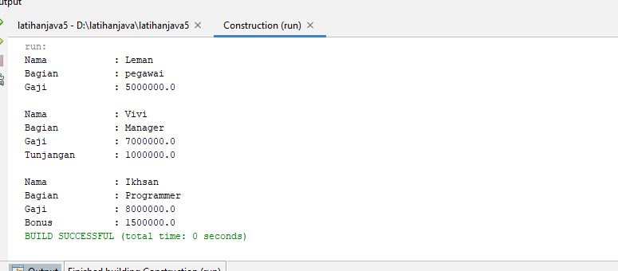

# latihanjava5
___
• Mendeklarasikan <i>class pegawai</i>
```java
public class pegawai {

    String name;
    String bagian;
    double gajipokok;

    // overload Constructor
    public pegawai(String name, String bagian, double gajipokok) {
        this.name = name;
        this.bagian = bagian;
        this.gajipokok = gajipokok;
    }
}

```
• Mendeklarasikan <i>class Manager</i> 
```java
public class Manager {

    String name;
    String bagian;
    double gajipokok;
    double tunjangan;

    public Manager(String name, String bagian, double gajipokok, double tunjangan) {
        this.name = name;
        this.bagian = bagian;
        this.tunjangan=tunjangan;
        this.gajipokok = gajipokok;
    }
}

```
• Mendeklarasikan <i>class Programmer</i> 
```java
public class Programmer  {
    String name;
    String bagian;
    double gajipokok;
    double bonus;
    
    // Overloading constructor inherite superclass
    public Programmer(String name, String bagian, double gajipokok, double bonus) {
        this.name = name;
        this.bagian = bagian;
        this.bonus=bonus;
        this.gajipokok = gajipokok;
    }
}

```
• Mendeklarasikan <i>class Bayaran</i> sebagai class main
```java
public class Bayaran {

    public static void main(String[] args) {
        pegawai pegawai = new pegawai("Leman", "pegawai", 5000000);
        Manager manager = new Manager("Vivi", "Manager", 7000000, 1000000);
        Programmer programmer = new Programmer("Ikhsan", "Programmer", 8000000, 1500000);

        System.out.println("Nama \t\t: " + pegawai.name);
        System.out.println("Bagian\t\t: " + pegawai.bagian);
        System.out.println("Gaji \t\t: " + pegawai.gajipokok);
        System.out.println("\nNama\t\t: " + manager.name);
        System.out.println("Bagian\t\t: " + manager.bagian);
        System.out.println("Gaji\t\t: " + manager.gajipokok);
        System.out.println("Tunjangan\t: " + manager.tunjangan);
        System.out.println("\nNama \t\t: " + programmer.name);
        System.out.println("Bagian \t\t: " + programmer.bagian);
        System.out.println("Gaji \t\t: " + programmer.gajipokok);
        System.out.println("Bonus \t\t: " + programmer.bonus);
    }
}
```
• Hasil Run

___
<b>SELESAI</b>
